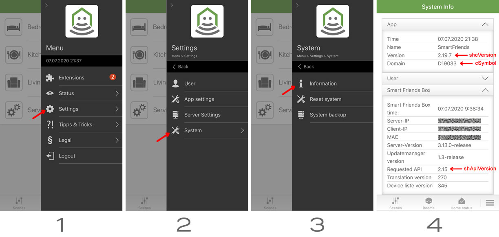

# SmartFriends REST API

## Description
This project is a simple bridge for the Smart Friends Box and devices (Schellenberg, ABUS, Paulmann, Steinel). There is a REST API and an MQTT client.

Tests have been carried out on on the Smart Friends Box but it probably also works on the Schellenberg SH1-Box.

You must have the [.Net 5.0 Runtime](https://dotnet.microsoft.com/download/dotnet/5.0) installed to use this.

A device **must** be supported by the Smart Friends Box to be controllable. So if you paired a Zigbee or Z-Wave device and do not see it in the Smart Friends app, then is unlikely you be able to control it with this bridge even though you will see the device listed.

## Installing

Recommended to use the HASSIO add-on. Add to the Supervisor Add-on store `https://github.com/GimpArm/hassio-addons`

See readme specific to service type for other install methods.

## How to use is bridge?

### MQTT or REST?
First decide if using MQTT or REST API.

MQTT will integrate into the [Home Assistant MQTT Integration(https://www.home-assistant.io/integrations/mqtt). The devices you setup and map will automatically be discovered by the integration creating devices and entities. It also takes advantage of the push notifications from the Smart Friends Box and relays them to the MQTT broker which informs Home Assistant. It is a more powerful interface but requires that you have configured a broker and the MQTT integration, along with some device mappings because the Smart Friends Box does not give enough information to accurately guess the what kind of device or how to control it in Home Assistant.

REST API is a more simple passive system. You must manually configure entities in Home Assistant to query the service along with polling for changes. This means there is usually a few seonc delay between manually operating a device and seeing its state change in Home Assistant.

### Configuration

**Both MQTT and REST API must be configured to talk to the Smart Friends Box.**

- Open the (appsettings.json) and change it accordingly:
  ```yaml
  {
  "SmartFriends": {
    "Username": "", #---------------> Username (case sensitive)
    "Password": "", #---------------> Password
    "Host": "", #-------------------> IP of your Smart Friends Box
    "Port": 4300, #-----------------> Port of the box, generally 4300/tcp
    "CSymbol": "D19033", #----------> Extra param 1
    "CSymbolAddon": "i", #----------> Extra param 2
    "ShcVersion": "2.21.1", #-------> Extra param 3
    "ShApiVersion":  "2.20" #-------> Extra param 4
  }
  ```
  **Extra API parameters**:
  In order to find these values, simply open the Smart Friends App and go to the information page as illustrated: 

  


### MQTT Configuration
[See README-mqtt.md](README-mqtt.md)

### REST API Configuration
[See README-rest.md](README-rest.md)

## Acknowledgments
Special thanks to [LoPablo](https://github.com/LoPablo) and [AirThusiast](https://github.com/airthusiast) for their work on figuring out how the Schellenberg/SmartFriends API functions.